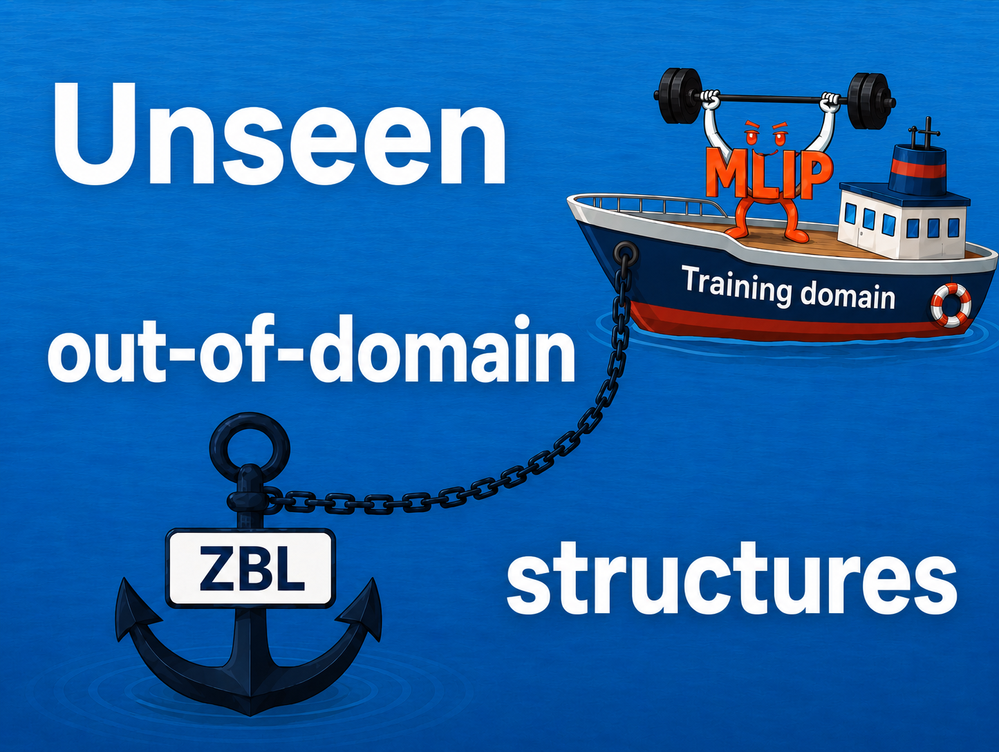
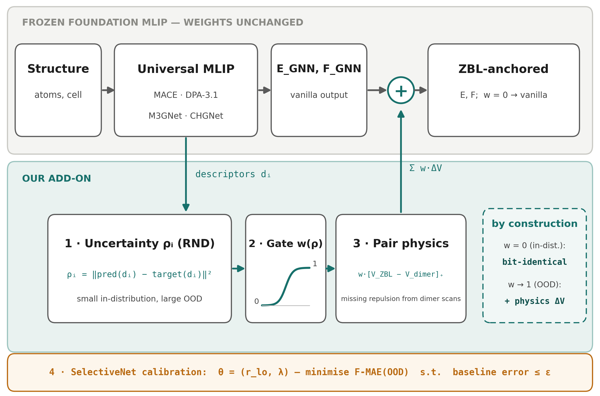
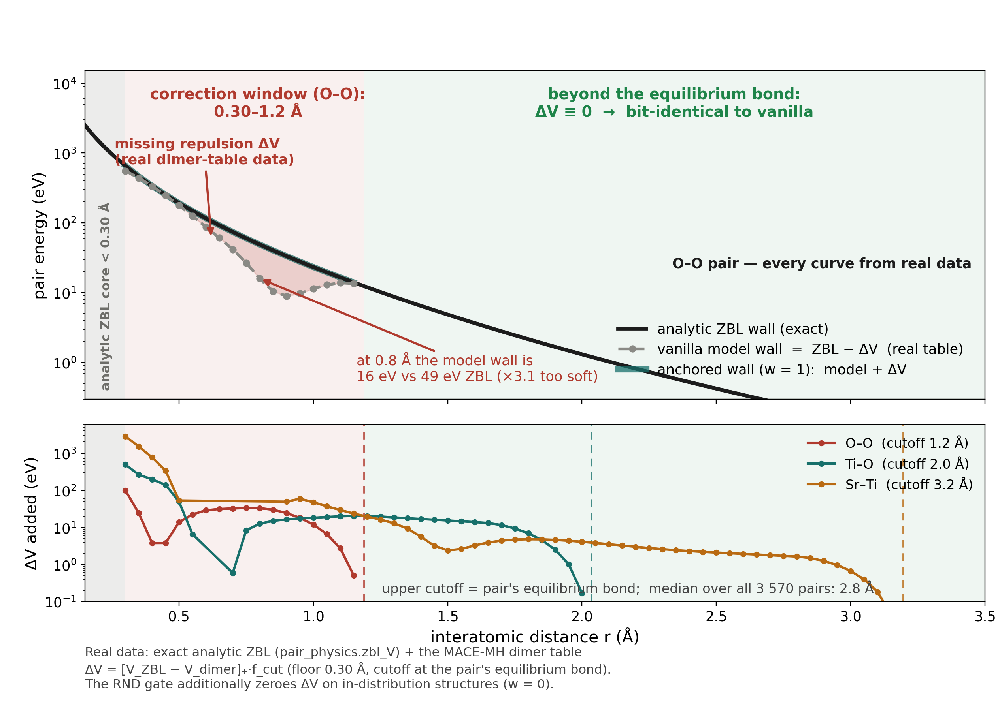
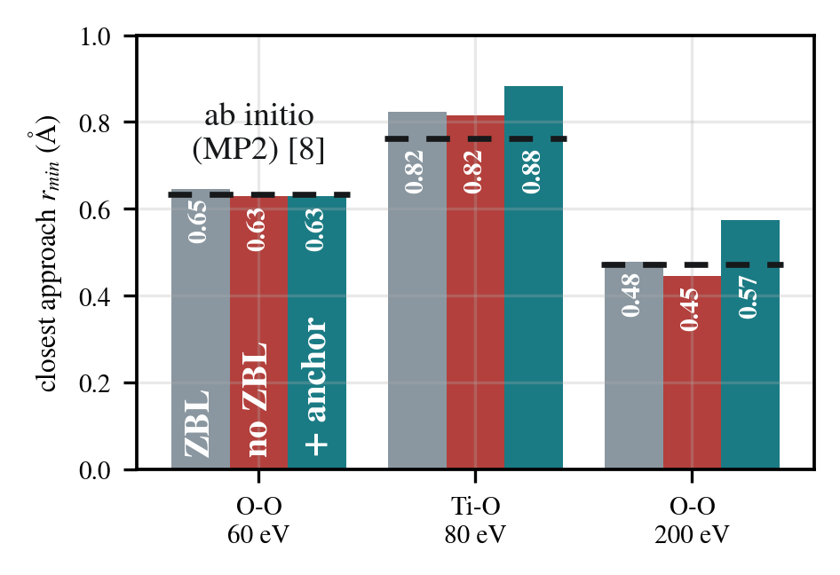
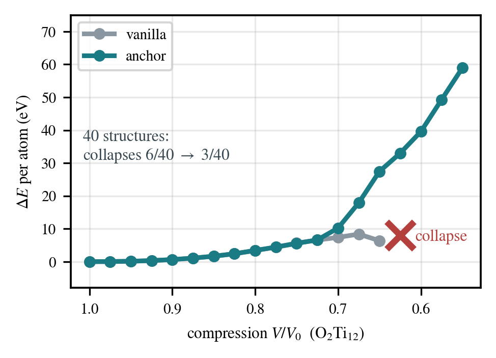
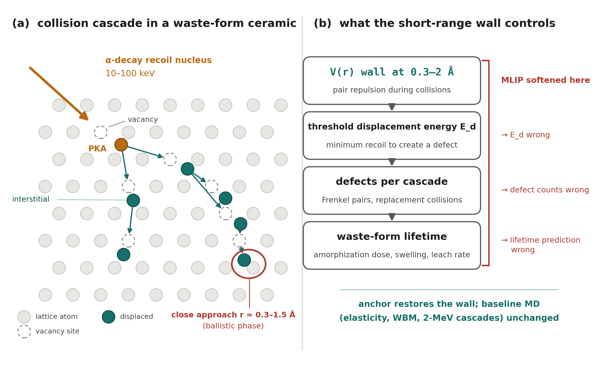

<p align="center">
  
</p>

# ZBL_anchored — a robust physical anchor for foundation MLIPs

> **Towards Robust Machine-Learned Interatomic Potentials for Radiation-Damaged
> Waste Immobilization Materials**
> Rudenko M.A., Mitrofanov A.A. — Chemistry Department, Lomonosov Moscow State University

Nuclear waste forms accumulate strongly non-equilibrium local environments —
recoil events, transmutation, defect build-up. Interatomic potentials must stay
**stable far from equilibrium** yet accurate for chemically complex oxides. But
foundation machine-learned interatomic potentials (MLIPs) such as **MACE-MH**,
**DPA-3.1**, **M3GNet**, and **CHGNet** are trained near equilibrium and *soften*
in distorted regions: on a distorted perovskite-family set (19 elements, DFT/VASP)
the force R² is **0.65 (MACE-MH-0) / −0.03 (DPA-3.1)**, and fine-tuning *destroys*
the inherited baseline.

This repository adds analytic short-range physics **at inference time, only where
the model is provably uncertain** — no retraining, and the base model's weights
are never touched:

$$
E = E_{\text{GNN}} + \sum_{i \lt j} w(\rho)\,\Delta V(r), \qquad
F = F_{\text{GNN}} - \lambda \sum_{i \lt j} w(\rho)\,\Delta V'(r)
$$

<p align="center">
  
</p>

- **ρ (uncertainty, RND)** — a per-atom novelty score `‖pred(dᵢ) − target(dᵢ)‖²`
  from a Random Network Distillation head over the model's own descriptors: small
  in-distribution, large out-of-distribution (OOD).
- **w(ρ) (gate)** — a smooth gate calibrated by a SelectiveNet risk–coverage
  criterion `θ = (r_lo, λ)`. Where the gate is silent (`w = 0`, in-distribution)
  the output is **bit-identical** to vanilla; on OOD it ramps to `w → 1`.
- **ΔV (pair physics)** — the missing short-range repulsion `w·[V_ZBL − V_dimer]₊`
  calibrated from dimer scans. ZBL is the special case `w → 1` as `r → 0`.

## Where the anchor acts — and what it fixes

Training data lives near equilibrium bond lengths, and the built-in ZBL of the
foundation models guards only the `r → 0` limit. In the **compressed-but-bonded
window in between, the GNN has essentially no data** and extrapolates a wall that
is far too soft: e.g. for the O–O pair at 0.8 Å the model's repulsion is 16 eV
where ZBL demands 49 eV — **3× too soft** (real dimer-table data, figure below).

<p align="center">
  
</p>

Every curve above is computed from the shipped code and data — the exact analytic
ZBL (`anchor/scripts/pair_physics.py`) and the model's own dimer table
`ΔV = [V_ZBL − V_dimer]₊·f_cut`. The correction window is **pair-specific**: it
runs from the 0.30 Å table floor up to the pair's equilibrium bond, where `f_cut`
takes it smoothly to zero — O–O 1.2 Å, Ti–O 2.0 Å, Sr–Ti 3.2 Å; the median upper
cutoff over all 3 570 tabulated element pairs is **2.8 Å**. Below 0.30 Å the
analytic ZBL takes over at full strength (keV collision regime). On top of this
distance window the RND gate keeps the correction off on in-distribution
structures (`w = 0`, bit-identical output) and ramps it to full strength on novel
local environments.

Two direct probes of that window (measured, not schematic):

<p align="center">
  
  
</p>

*Left — head-on collisions:* ab initio (MP2) turning points for O–O and Ti–O
recoils at 60–200 eV lie at `r_min ≈ 0.45–0.9 Å`, squarely inside the gap.
Without ZBL the vanilla model lets atoms punch through the wall (`r_min` 0.45 Å
vs the 0.47 Å reference at 200 eV); the anchored model stops them at or above
the reference. *Right — static compression:* compressing an O₂Ti₁₂ perovskite
cell, vanilla MACE-MH-0's energy flattens and the structure collapses at
`V/V₀ ≈ 0.63` (atoms fuse, minimum distance → 0.22 Å); the anchored model rises
steeply, as physics demands. Over 40 compressed structures, collapses halve
(6/40 → 3/40) and never get worse.

## Why short range decides waste-form performance

Ceramic waste forms — pyrochlore, zirconolite, perovskite-family titanates (our
distorted evaluation set spans 19 elements) — immobilize actinides, and the
actinides irradiate their own host from within: every α-decay launches a recoil
nucleus carrying 10–100 keV. The recoil sets off a collision cascade, and during
its ballistic phase atoms are driven to separations of **0.3–1.5 Å** — precisely
the window where foundation MLIPs soften.

<p align="center">
  
</p>

The short-range wall is what everything downstream depends on: it sets the
threshold displacement energies `E_d`, which set defect production per cascade
(Frenkel pairs), which set the amorphization dose, swelling and leach rate —
the quantities that decide the predicted service life of the waste form. A wall
that is too soft gives wrong `E_d`, wrong defect counts, and in the worst case
lets the simulation collapse mid-cascade.

The anchor restores the wall only where it is needed, so the well-tested
baseline behaviour (elasticity, WBM stability, 2-MeV cascade observables) stays
untouched. The radiation-damage validation suite lives in
[`anchor/raddmg/`](anchor/raddmg/) — SrTiO₃ `E_d` checks, defect statics, recoil
sweeps and Wigner–Seitz cascade analysis; MD deployment via
[`lammps/`](lammps/) runs to ~70 k atoms per GPU.

## Key results — force R² on three held-out sets (vanilla → anchor)

| Model | MPtrj (baseline) | weakly distorted (target) | distorted (compressed OOD) | ΔF-MAE | overhead (fused) |
|---|:---:|:---:|:---:|:---:|:---:|
| **MACE-MH-0** | 0.986 ≡ | 0.998 ≡ | 0.650 → **0.829** | −6.7% | ×1.07 |
| **DPA-3.1** | 0.963 ≡ | 0.995 ≡ | −0.033 → **0.733** | −17.0% | ×1.40 |
| **M3GNet** | 0.597 ≡ | 0.992 ≡ | 0.104 → **0.782** | −17.1% | ×1.17 |
| **CHGNet** | 0.936 ≡ | 0.990 ≡ | 0.005 → 0.014 | −1.9% | ×1.20 |

On the **MPtrj (baseline)** and the **weakly distorted (target)** sets the anchor is
**bit-identical** to vanilla (the gate is silent, `w = 0` — marked `≡`). OOD force R²
is restored to **0.73–0.83 on three of four MLIPs with zero weight updates**.
(CHGNet's 64-d descriptors give no novelty tail, so the gate cannot fire there.)

**The gating signal is the method.** RND novelty separates the distorted set from the
baseline with **0 % false positives** (max baseline ρ = 0.010 vs threshold r_lo = 0.05);
the rejected first-generation k-NN distance gate overlaps and flags 22 % of baseline /
72 % of target atoms. Fine-tuning instead degrades every in-distribution set
(MPtrj 0.98 → 0.70), diverges on the distorted set, and shrinks element coverage
from 89 to 19 species. The anchor is deployment-ready: **+1–4 MB, ×1.07–1.4 cost,
LAMMPS MD to ~70 k atoms/GPU.**

## Repository layout

```
ZBL_anchored/
├── anchor/                 # the method on top of MACE (core)
│   ├── scripts/            #   RND/rho gates, pair-physics, calibration, tuning, eval, figures
│   ├── md_stability/       #   AnchorCalculator + MD short-range stability suite
│   └── raddmg/             #   radiation-damage validation (defects, recoil, SrTiO3, Wigner–Seitz)
├── dpa_variant/            # the same method on top of DPA-3.1
├── mace_zbl_training/      # ZBL-MACE fine-tuning / evaluation pipeline (01…06)
├── lammps/                 # deploying the potentials in LAMMPS via fix external
│   ├── scripts/            #   mlip_fixext.py driver + profilers + build/convert utilities
│   ├── mace_smoke/ dpa_smoke/  numerical reference smoke tests
│   └── examples/           #   ready-to-edit input decks
├── benchmarks/             # MACE acceleration benchmarks (fp32 / cuEquivariance / torch.compile)
├── patches/                # bit-identical safe-optimisation patch for MACE
├── figures/                # poster, hero image, method scheme + figure-generation code
├── config.example.env      # every external path is an env var — copy to config.env and fill in
└── environment.yml
```

Each sub-directory has its own README with run instructions.

## What is *not* in this repository

By design the repo contains **code only**. The following are excluded (see
`.gitignore`) and must be supplied by the user:

- **Foundation model weights** (MACE-MH-0/1, DPA-3.1, …). These are governed by the
  upstream model licenses (e.g. the ACEsuit models are released under a
  non-commercial academic license) and are **not** redistributed here. See
  `mace_zbl_training/scripts/01_download_models.py` and the upstream releases.
- **Evaluation datasets** (VASP splits, MPtrj subsets). Point the scripts at your
  own copies via the environment variables in `config.example.env`.
- **Generated artifacts** (`rnd.pt`, `rho_reference.npz`, dimer tables) — build
  them locally with the scripts in `anchor/scripts/`.
- Large run outputs, logs, and third-party libraries.

## Setup

```bash
git clone https://github.com/Mirual/ZBL_anchored.git && cd ZBL_anchored
conda env create -f environment.yml    # or use your own env with ASE/MACE/torch
cp config.example.env config.env        # then edit config.env with paths on your machine
source config.env
```

No script hard-codes a machine-specific path; every external resource is read from
an environment variable documented in `config.example.env`.

## License

The code in this repository is released under the **MIT License** (see `LICENSE`).
Foundation model weights, third-party libraries (MACE, DPA/DeePMD-kit,
cuEquivariance, e3nn, ASE, …) and datasets retain their own licenses and are not
covered by this repository's license.

## Citation

If you use this work, please cite the accompanying study (poster: *Towards Robust
Machine-Learned Interatomic Potentials for Radiation-Damaged Waste Immobilization
Materials*, Rudenko & Mitrofanov, Lomonosov MSU) and the underlying MACE, DPA-3.1,
RND, and SelectiveNet references. The `patches/mace_safe_opts.patch` applies against
ACEsuit/mace commit `4d2da09`.
